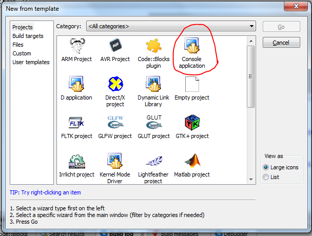
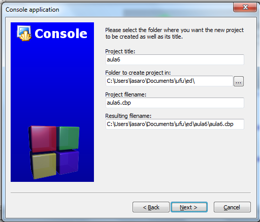
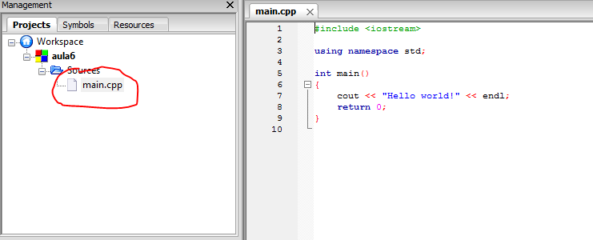
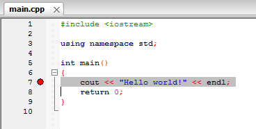

# Compilação e Execução
Para colocarmos nossos algoritmos em execução, o primeiro passo é escrevê-los, usando um editor de textos qualquer que salve arquivos em texto puro, como o notepad, vim, gedit, etc. A este arquivo com o *código* chamaremos *código fonte* ou simplesmente *fonte*. Uma vez de posse do fonte, é preciso submetê-lo a um processos com vários passos que gera, ao final, um arquivo executável ou o que chamamos, comumente, de *programa*. O processo como um todo, descrito na seção seguinte, é conhecido como *compilação*, apesar de compilação ser apenas um dos passos do processo.

## O processo de compilação
A sequência de passos que compõem a compilação é a seguinte:

Código Fonte $→$ Pré-processador $→$ Fonte Expandido $→$ Compilador $→$ Arquivo Objeto $→$ Ligador $→$ Executável

De forma simplificada, a pré-compilação é um passo que modifica o código fonte substituindo certas "palavras chave" encontradas ao longo do texto por suas definições. Por exemplo, pode-se definir que, no programa, toda vez que o pré-processador encontrar a palavra PI, ele a substituirá por 3.141649. A utilidade da pré-compilação ficará mais clara mais adiante no curso.

Uma vez terminada a pré-compilação, acontece a compilação do seu programa. A compilação traduz o código que você escreveu para uma linguagem inteligível ao computador, salvando-o em um arquivo chamado arquivo objeto. Por exemplo, a compilação transformaria o código "Olá Mundo!" escrito acima em algo como %http://farid.hajji.name/blog/2009/12/26/hello-world-in-freebsd-assembler/
```
...
CALL  write(0x1,0x400623,0xe)
GIO   fd 1 "Olá Mundo!"
RET
 ...
```

Após a compilação vem a *linkedição*, o passo que junta o seu arquivo objeto a outros arquivos objetos interessantes, como por exemplo um que contenha código de funções matemáticas, manipulação de arquivos, ou interação gráfica com o usuário. (Embora a explicação dada aqui não seja estritamente correta, ela é próxima o suficiente da realidade para o escopo deste curso.)

## A IDE Code::Blocks
Embora a edição de um programa possa ser feita em praticamente qualquer editor de textos, há certos editores que são mais adequados a esta tarefa. Tais editores fazem, dentre outras, a colorização das palavras de seu código de forma a ajudá-lo a detectar erros e tentam alinhar automaticamente as linhas do seu código. A intenção destes editores é aumenentar sua produtividade como programador. Outros editores vão ainda mais longe e lhe permitem fazer todo o processo de compilação com um simples *click* do mouse ou apertar de uma tecla. Estes editores mais completos são conhecidos como *Integrated Development Environment*, ou simplesmente IDE.

No decorrer deste curso consideraremos que o aluno estará usando a IDE [Code::Blocks](http://www.Code::Blocks.org), que é gratuita e com versões para Windows, Linux e OSX. Entretanto, qualquer outra IDE ou mesmo a compilação manual podem ser usados em substituição ao Code::Blocks.

### Criando um Projeto
Para começar a programar no Code::Blocks, precisamos criar um *projeto*. Este projeto conterá seu código fonte e, no caso de uma programação mais avançada, arquivos de imagens, definições de personalização do processo de compilação, etc. Para criar um projeto no Code::Blocks, clique em **File** e, em seguida, **New**, **Project**.

Na tela que se apresenta, você deve escolher o tipo de projeto a ser criado. Não se perca nos tipos; escolha **Console Application** e então clique em **Go**.



Na tela seguinte você deverá escolher a linguagem de programação usada; escolha C++ e clique em **Next** para passar para a tela onde deverá nomear o seu projeto. Em **project title** escreva algo como teste1; em **folder to create the project in**, clique no botao com ... e escolha uma pasta para salvar o projeto; esta pode ser, por exemplo, a pasta **Meus Documentos** ou uma pasta qualquer em um *pen drive*. (O importante aqui é salvar o arquivo em um lugar em que você possa voltar mais tarde para reler.). Clique então **Next** e, na tela seguinte, clique em **Finish**.



Pronto, seu projeto foi criado. Agora abra o arquivo **main.cpp**, que está na pasta **sources**, dando um clique duplo no nome do arquivo. Observe que o Code::Blocks criou automaticamente um programa básico.



Finalmente, clique  em **build** e então em **build and run**. Parabéns, você acaba de executar seu primeiro programa.

### Depuração
Todo programa de tamanho considerável, e mesmo aqueles de tamanho diminuto, possuirão, ao menos em suas versões iniciais, erros. Por razões históricas, nos referimos a estes erros por *bugs*<!-- TODO: Referência para o uso de bug -->. Uma das formas de achar os bugs do seu programa é fazer com que o computador execute seu programa passo a passo, isto é, linha a linha, e acompanhar esta execução verificando se o programa faz o que você espera.

Para experimentarmos a depuração, processo pelo qual removemos bugs, modifique a mensagem "Hello world!" do seu programa para "Olá <seu nome>!" e execute novamente o programa (**build and run**). Se o programa executou normalmente, você está no caminho certo. Agora, copie toda a linha contendo a mensagem e cole-a várias vezes, substituindo o nome em cada linha. Seu programa deve ficar como no Código

```c
// Programa com vários Hello's.
#include <iostream>

using namespace std;

int main()
{
    cout << "Hello Joao!" << endl;
    cout << "Hello Jose!" << endl;
    cout << "Hello Joaquim!" << endl;
    cout << "Hello Joselino!" << endl;
    cout << "Hello Asdrubal!" << endl;
    return 0;
}
```

Mais uma vez, compile e execute seu programa. Se a execução foi bem sucedida, você está pronto para a depuração. Para depurar, clique ao lado direito do número 7 (sétima linha do programa), até que uma bolinha vermelha apareça, como na figura a seguir. A bolinha vermelha é, na verdade, um sinal de pare, e diz ao computador que deve, ao executar seu programa, parar ali.



Se você for adiante e executar o programa como fizemos até agora, verá que o pare não funcionou. Isto é por que o sinal é ignorado a não ser que você inicie a execução em modo de depuração. Para fazer isso, clique no menu **Debug** e então em **Start** ou, alternativamente, pressione a tecla F8. Observe que a execução parou onde você esperava. Agora, clique em **Debug** e **Next Line** ou aperte F7, no teclado, sucessivamente para ver o que acontece. Observe que cada linha é executada e então a execução pára novamente.

## O Arquivo Executável
Agora que você já escreveu programas super interessantes, os compilou e executou, imagine como faria para enviar tais programas a um amigo que não tenha qualquer interesse ou aptidão em programação. A solução é simples: mandaremos a este amigo o arquivo executável do programa. Para fazê-lo, abra a pasta na qual salvou seu projeto Code::Blocks. Nesta pasta você encontrará um arquivo com extensão `.exe`; este é o arquivo executável que deveria enviar para seu amigo. Quando seu amigo executar este programa, verá exatamente a mesma coisa que você viu quando o fez. Além de ser muito útil, este procedimento é também uma ótima forma de se compartilhar vírus de computador.

## Exercícios
!!! question "Exercício"
    Escreva o programa completo que calcula a área de vários retângulos do capítulo anterior e execute-o.

!!! question "Exercício"
    Altere seu programa para usar, além da função de cálculo de área de um quadrado, as funções definidas nos exercícios do capítulo anterior.
