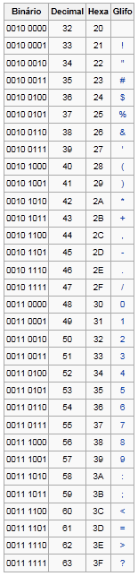
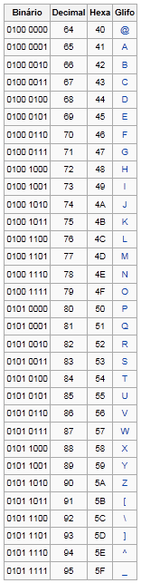
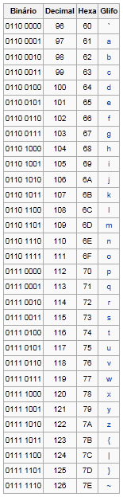

# Caracteres, Vetores de Caracteres e Strings
## Representação de caracteres
Além dos tipos de dados numéricos com os quais temos trabalhado até agora, outro tipo de dado é muito importante no desenvolvimento de programas de computador, o tipo caractere. Estes tipos são a base para representação de informação textual como, por exemplo, a frase "eu amo programar em C"? 

Variáveis com caracteres, em C(++), são declarados com sendo do tipo `char`, e sua leitura e escrita ocorre como para qualquer outro tipo de dados. Por exemplo, 

```c
#include<iostream>

using namespace std;

int main()
{
  char letra;

  cout << "digite uma letra qualquer seguida de enter ";
  cin >> letra; 
  cout << "voce digitou "<< letra << endl;
  
  return 0;
}
```

Se você pretende atribuir um caracter diretamente a uma variável, é importante se atentar à seguinte notação: caracteres são sempre escritos entre aspas simples. Por exemplo, ''a'', `'3'' ou `'.'`. 

Raramente você trabalhará com caracteres um a um, normalmente usando vetores para armazenar palavras e frases.

## Vetores de Caracteres
Vetores podem conter dados de quaisquer tipos. Isto é, você pode declarar vetores de números reais ou inteiros, booleanos, e até tipos definidos por você, uma vez que aprenda como definir novos tipos. Um outro tipo interessante é o caractere, ou simplesmente `char`. Por exemplo, vamos definir um programa que leia um vetor de 10 caracteres e depois os escreva de volta à tela.

```c
#include<iostream>

using namespace std;

#define TAMANHO 10

int main()
{
  char nome[TAMANHO];

  cout << "Digite " << TAMANHO << " caracteres: ";
  
  for(int i = 0; i < TAMANHO; i++)
  {
      cin >> nome[i]; 
  }
  
  cout << "Os caracteres digitados foram: ";
  for(int i = 0; i < TAMANHO; i++)
  {
         cout << nome[i];
  }
  
  cout << endl;
  
  return 0;
}
```

Agora, só para tornar as coisas mais interessantes, alteremos o programa para que leia *até* 100 caracteres, mas que pare de lê-los tão logo um "." seja digitado. Para representar um caractere em C(++), use aspas simples, isto é, ''.'`.

```c
#include<iostream>

using namespace std;

#define TAMANHO 100

int main()
{
  char nome[TAMANHO];
  int i = 0;
  
  cout << "Digite ate " << TAMANHO << " caracteres. Para terminar antes, digite '.' ";

  do
  {
      cin >> nome[i]; 
      i++;
  }while( i < TAMANHO && nome[i-1] != '.');
  
  cout << "Os caracteres digitados foram: "
  for(int i = 0; i < TAMANHO && nome[i] != '.'; i++)
  {
         cout << nome[i];
  }
  
  cout << endl;
  
  return 0;
}
```

Caracteres são, na verdade, números disfarçados e seguem uma codificação específica. Uma pessoa pode decidir que o 'a' será o 1, o 'b' será o 2 e assim por diante. Mas como outra pessoa que receber a informação saberá disso? Para evitar este problema a representação de caracteres como números foi padronizada. Os principais padrões existentes são: ASCII, EBCDIC e Unicode.

### ASCII
ASCII, ou *American Standard Code for Information Interchange*, é o padrão mais utilizado, presente em todos os nossos computadores pessoais. Trata-se de uma codificação de caracteres de oito bits baseada no alfabeto inglês.

A codificação define 256 caracteres ($2^8$). Desses, 33 não são imprimíveis, como caracteres de controle atualmente não utilizáveis para edição de texto, porém amplamente utilizados em dispositivos de comunicação, que afetam o processamento do texto. Exceto pelo caractere de espaço, o restante é composto por caracteres imprimíveis.

A Figura exibe a tabela ASCII.







*Tabela ASCII*

A linguagem C provê um atalho para que você não tenha que recorrer à tabela ASCII sempre que precisar do valor de um caractere: para obter o valor de um caractere qualquer, basta colocá-lo entre aspas simples. Isto é, para verificar se um caracter 'c` é uma letra maiúscula, por exemplo, basta efetuar o teste `if(c >= 'A' && c <= 'Z')`.

### Outras representações
As representações EBCDIC (*Extended Binary Coded Decimal Interchange Code*) e Unicode também mapeiam os caracteres em números de 8 e 16 bits, respectivamente.

EBCDIC é utilizado principalmente em *mainframes* IBM. O padrão Unicode foi criado para acomodar alfabetos com mais de 256 caracteres.

## Exercícios
!!! question "Exercício"
    Escreva um programa que leia 10 caracteres e os imprima na ordem inversa àquela em que foram digitados.

!!! question "Exercício"
    Escreva um programa que leia 10 caracteres e os imprima na ordem inversa àquela em que foram digitados, trocando maiúsculas por minúsculas e vice-versa.

!!! question "Exercício"
    Escreva seu nome na codificação ASCII.

## Laboratório
!!! example "Laboratório"
    Escreva um programa que leia 100 caracteres ou até que ''#'` seja digitado e os imprima na ordem inversa àquela em que foram digitados.

!!! example "Laboratório"
    Escreva um programa que leia e imprima *strings* até que o usuário digite a palavra 'fim'. Considere que cada *string* não possui espaços.

!!! example "Laboratório"
    Escreva um programa que leia e imprima *strings* até que o usuário digite a palavra 'fim'. As *strings* podem conter espaços.

!!! example "Laboratório"
    Acompanhe as atividades a seguir:
    
    Execute o seguinte programa e observe o que será impresso. Atente para as atribuições!
    ```c
    #include<iostream>

    using namespace std;

    int main()
    {
      int a;
      char c;
      for(a = 65; a < 91; a++)
      {
        c = a;
        cout << c << endl;
      }
      return 0;
    }
    ```
    Você deve ter observado que os números não foram impressos, e sim as letras de 'A' a 'Z'. Olhe a tabela na Figura e descubra o porquê.

!!! example "Laboratório"
    Modifique o programa a seguir para imprimir as letras de 'a' a 'z', ou seja, as letras minúsculas do alfabeto inglês.

!!! example "Laboratório"
    Agora faça um programa que leia caracteres informados pelo usuário enquanto ele não pressionar a tecla ESC. Para cada caractere informado pelo usuário, escreva o número correspondente na tabela ASCII.

!!! example "Laboratório"
    Modifique o programa anterior para que solicite que o usuário entre com letras minúsculas de 'a' a 'z' e imprima na tela, para cada letra, a maiúscula correspondente.

## Vetores de Caracteres como *Strings*
Um vetor de caracteres é essencialmente uma palavra ou uma frase. Assim, durante a leitura de um vetor de caracteres dificilmente sabe-se quantos caracteres serão digitados pelo usuário, por exemplo, quando deseja-se ler o nome de um indivíduo. Por este motivo, a maioria das linguagem de programação fornece métodos especiais de leitura, impressão e manipulação desses vetores de caracteres, ou como chamaremos agora, *strings*.

Na linguagem C++, os comandos `cout` e `cin` permitem imprimir e ler *strings* de maneira direta:

```c
#include<iostream>

using namespace std;

#define TAMANHO 100

int main()
{
  char nome[TAMANHO];
  
  cout << "Digite ate " << TAMANHO << " caracteres. Para terminar pressione ENTER:";

  cin >> nome;
  cout << "Os caracteres digitados foram: " << nome << endl;
  
  return 0;
}
```

Entretanto, o comando `cin`, não permite, da forma como vimos até agora, a leitura de uma *string* que contenha espaços (uma frase, por exemplo). Para que isso seja possível precisamos utilizar a função `cin.getline()`. Esta função necessita de dois argumentos: o vetor de caracteres representando a *string* e o tamanho máximo de caracteres que será lido. A leitura é realizada até que seja atingido ou número máximo de caracteres ou o usuário pressione a tecla ENTER. A seguir uma modificação do exemplo anterior:

```c
#include<iostream>

using namespace std;

#define TAMANHO 100

int main()
{
  char nome[TAMANHO];
  
  cout << "Digite seu nome completo. Para terminar pressione ENTER:";

  cin.getline(nome, TAMANHO);
  cout << "Seu nome eh: " << nome << endl;
  
  return 0;
}
```

Por último, é importante entender que para marcar no vetor de caracteres até onde foi feita a leitura a linguagem C adiciona o caractere especial ''\0'' após o último caractere digitado pelo usuário. Desta forma, quando se deseja percorrer uma string, diferentemente de um vetor número, define-se como condição de parada a posição em que se encontra o `'\0'` e não o fim do vetor.

## Laboratório
!!! example "Laboratório"
    Faça um programa que leia uma string e calcule e imprima o tamanho desta string em uma função auxiliar.

!!! example "Laboratório"
    Faça um programa que leia uma string e verifique se a string lida é uma palíndrome. A verificação deve ser feita em uma função auxiliar, que deve retornar `true` em caso afirmativo ou `false` caso contrário.

!!! example "Laboratório"
    Faça um programa que leia uma string e a imprima de trás para frente, trocando as vogais pelo caractere '*'.

!!! example "Laboratório"
    Faça um programa que leia duas strings e concatene a segunda na primeira, separadas por um espaço em branco. A concatenação deve ser feita em uma função auxiliar.

## Funções para manipulação *Strings*
Quando trabalhamos com *strings* é muito comum a realização de algumas tarefas como descobrir
o tamanho da palavra digitada pelo usuário, comparar duas palavras para saber a ordem, ou ainda,
concatenar duas palavras em uma única.

Para isso, a biblioteca `string.h` fornece algumas funções prontas, como pode ser visto na
tabela

  
  | Função | Descrição |
| --- | --- |
| strlen | retorna o tamanho (em caracteres) da palavra passada como argumento. |
| strcpy | copia o conteúdo da segunda *string* para a primeira. |
| strcat | concatena o texto da segunda *string* na primeira. |
| strcmp | compara duas *strings* (vide exemplo a seguir). |
| stricmp | compara duas *strings* sem diferenciar maiúsculas e minúsculas. |
| atoi | converte uma *string* para o inteiro correspondente. |
| atof | converte uma *string* para o número real correspondente. |
  *Algumas funções para trabalhar com *strings*.*

  

O exemplo a seguir mostra a utilização destas funções:

```c
  #include<string.h>
  #include<iostream>

  using namespace std;

  int main()
  {
    char str1[50], str2[50];
    int i;
    float f;

    cout << ``Entre primeiro nome:'';
    cin >> str1;
    cout << ``Entre ultimo nome:'';
    cin >> str2;
    strcat(str1, `` ''); //junto espaco com str1
    strcat(str1, str2);
    cout << ``Seu nome completo eh '' << str1 << endl;
    cout << ``Ele possui '' << strlen(str1) << `` caracteres.'' << endl;
    
    cout << ``Entre outro nome:''.
    cin >> str2;

    //comparacao de strings
    if(strcmp(str1, str2) == 0)
    {
      cout << ``os dois nomes sao iguais.'' << endl;
    }
    else if(strcmp(str1, str2) < 0)
    {
      cout << str1 << `` vem antes de'' << str2 << endl;
    }
    else
    {
      cout << str2 << `` vem antes de '' << str1 << endl;
    }
    return 0;
  }
```

No uso destas funções, é importante manter-se em mente que o espaço adequado deve ser alocado para a string resultante das operações. Por exemplo, ao se concatenar duas strings de no máximo 100 caracteres, o resultado terá, no máximo, 200 caracteres.

## Funções com vetores como parâmetros
As funções descritas acima recebem strings como parâmetros. Agora, veremos como definir suas funções próprias funções que recebem não somente strings, mas vetores de outros tipos de dados.

A declaração de uma variável do tipo vetor segue, como já visto, a seguinte forma.

```
tipo identificador[tamanho];
```

A declaração de parâmetros segue uma sintaxe parecida, no qual o tamanho do vetor não aparece
```
tipo identificador[]
```
Isto ocorre por que, para que a função seja genérica e opere em qualquer vetor passado, o parâmetro não pode ser especificado em código. Assim, a declaração de uma função que recebe um vetor como parâmetro segue a seguinte receita:

```
tipo identificadorDaFuncao(tipo identificador1[], int tamanho1, ...)
{
    Corpo da Funcao
}
```

Por exemplo, veja como definir uma função que transforme todos os caracteres de uma string para letras maíusculas.

```c
  #include<string.h>
  #include<iostream>

  using namespace std;

  void maiusculas(char str[], int tam)
  {
     for(int i = 0; i < tam && i < strlen(str); i++)
     if(str[i] >= 'a' && str[i] <= 'z')
     	str[i] = str[i] - 'a' + 'A';
  }

  int main()
  {
    char str[50];
    cout << ``Digite seu primeiro nome:'';
    cin >> str;
    
    maiusculas(str, 50)
    
    cout << str << endl;
    return 0;
  }
```

Observe que a função **altera** a string passada como parâmetro, um comportamento diferente do que aconteceu quando uma variável que não é um vetor é passada. Este comportamento será estudado mais a fundo em capítulos posteriores.

Da mesma forma que uma string, um vetor de outro tipo de dados pode ser passado como parâmetro. A função a seguir, por exemplo, calcula qual o maior inteiro em um vetor de inteiros.

```c
  #include<iostream>

  using namespace std;

  int maior(int v[], int tam)
  {
     int maior = -1;
     for(int i = 0; i < tam ; i++)
        if(v[i] > maior)
            maior = v[i];
            
     return maior;
  }
```

## Laboratório
!!! example "Laboratório"
    Faça um programa que dado uma string, retorne 1 se ela for palíndromo e 0 se ela não for palíndromo. Lembrando que um palíndromo é uma palavra que tenha a propriedade de poder ser lida tanto da direita para a esquerda como da esquerda para a direita. Deve-se obrigatoriamente utilizar uma `string` auxiliar e a função `strcmp` para fazer a resolução.
    
    Ex: SUBI NO ONIBUS  ARARA  ANOTARAM A DATA DA MARATONA

!!! example "Laboratório"
    Faça um programa que troque todas as ocorrências de uma letra L1 pela letra L2 em uma *string*. A *string* e as letras L1 e L2 devem ser fornecidas pelo usuário.

!!! example "Laboratório"
    Faça um programa que leia 3 *strings* e as imprima em ordem alfabética.

!!! example "Laboratório"
    Faça um programa com uma função que receba um vetor de inteiros e um inteiro X, e que retorne como resultado o maior inteiro do vetor que é menor que o inteiro X.

!!! example "Laboratório"
    Usando a resposta do problema anterior, faça um programa com uma função que receba dois vetores de inteiros, e que faça com que o segundo torne-se uma cópia do primeiro, ordenado de forma decrescente.
