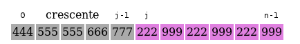
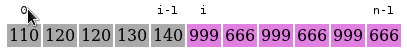
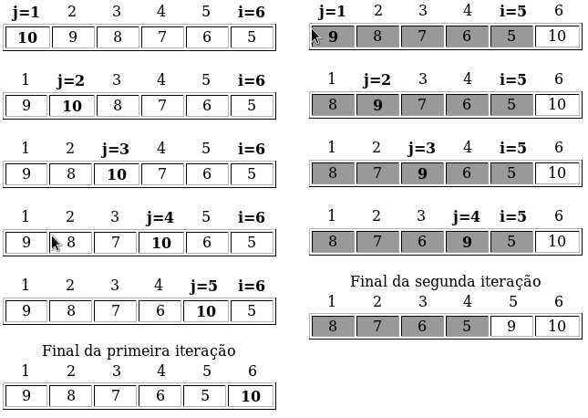

# Ordenação de Arranjos

## Introdução
Uma das aplicações mais estudadas e realizadas sobre arranjos é a **ordenação**. Ordenar um
arranjo significa permutar seus elementos de tal forma que eles fiquem em ordem crescente, ou
seja, $v[0] <= v[1] <= v[2] <= ...{} <= v[n-1]$.  Por exemplo, suponha o vetor
$v = {5, 6, -9, 9, 0, 4}$. 
Uma ordenação desse vetor resultaria em um rearranjo de seus elementos: 
$v = {-9, 0, 4, 5, 6, 9}$.

Exitem diversos algoritmos de ordenação para vetores. Eles variam em relação à dificuldade de
implementação e desempenho. Usualmente algoritmos mais fáceis de serem implementados apresentam
desempenho inferior.  Veremos 3 algoritmos diferentes de ordenação:
1. Algoritmo de Inserção (*Insertion Sort*);

2. Algoritmo de Seleção (*Selection Sort*); e

3. Algoritmo de Ordenação por Troca (*Bubble Sort*).

## Algoritmos de Ordenação
### Algoritmo de Inserção (*Insertion Sort*)
Trata-se de um dos algoritmos de implementação mais simples. Seu método de ordenação semelhante ao
que usamos para ordenar as cartas de um baralho.  A idéia básica do algoritmo é descrita a seguir:
- Compare a chave (`x`) com os elementos à sua esquerda, deslocando para direita cada elemento maior do que a chave;

- Insira a chave na posição correta à sua esquerda, onde os elementos já estão ordenados;

- Repita os passos anteriores atualizando a chave para a próxima posição à direita até o fim do vetor.
A figura apresenta um exemplo de uma etapa da execução do algoritmo.

  
    
  
  *Exemplo do algoritmo *Insertion Sort*.*

  

O código a seguir implementa o algoritmo em C, considerando um vetor `v` de tamanho `n`.
```c
void insertionSort(int v[], int n)
{
  int i, j, x;
  for(i = 1; i < n; i++) 
  {
    x = v[i];
    j = i - 1;
    while(j >= 0 && v[j] > x) 
    {
      v[j+1] = v[j];
      j--;
    }
    v[j+1] = x;
  }
}
```

### Algoritmo de Seleção (*Selection Sort*)
A implementação deste método de ordenação é muito simples. A idéia básica é descrita a seguir:
- Selecione o menor elemento do vetor de tamanho `n`;

- Troque esse elemento com o elemento da primeira posição do vetor;

- Repita as duas operações anteriores considerando apenas os `n-1` elementos restantes, em
    seguida repita com os `n-2` elementos restantes; e assim sucessivamente até que reste apenas um
    elemento no vetor a ser considerado.
A figura apresenta um exemplo da execução do algoritmo.

  
    
  
  *Exemplo do algoritmo *Selection Sort*.*
		
  

O código a seguir implementa o algoritmo em C, considerando um vetor `v` de tamanho `n`.
 ```c
void selectionSort(int v[], int n)
{
  int i, j, aux, min;
  for(i = 0; i < n-1; i++) 
  {
    min = i;
    for(j = i+1; j < n; j++) 
    {
      if(v[j] < v[min]) 
      {
	min = j;
      }
    }
    aux = v[i]; v[i] = v[min]; v[min] = aux; //troca
  }
}
```

### Algoritmo de Ordenação por Troca (*Bubble Sort*)
Outro algoritmo simples, muito útil para ordenação de vetores pequenos, mas não indicado para
vetores maiores devido ao seu baixo desempenho computacional. Sua déia básica é apresentada a
seguir:
- Compare o primeiro elemento com o segundo. Se estiverem desordenados, então efetue a troca
    de posição. Compare o segundo elemento com o terceiro e efetue a troca de posição, se
    necessário;

- Repita a operação anterior até que o penúltimo elemento seja comparado com o último. Ao
    final desta repetição o elemento de maior valor estará em sua posição correta, a n-ésima posição
    do vetor;

- Continue a ordenação posicionando o segundo maior elemento, o terceiro,..., até que todo o
    vetor esteja ordenado.
A figura apresenta um exemplo de um vetor sendo ordenado pelo algoritmo.

  
    
  
  *Exemplo de ordenação usando o algoritmo *Bubble Sort*.*

  

O código a seguir implementa o algoritmo em C, considerando um vetor `v` de tamanho `n`.
```c
void bubbleSort(int v[], int n)
{
  int i, j, aux;
  for(i = n-1; i > 0; i--) 
  {
    for(j = 0; j < i; j++) 
    {
      if(v[j] > v[j+1]) 
      {
	aux = v[j]; v[j] = v[j+1]; v[j+1] = aux; //troca
      }
    }
  }
}
```

## Exercícios
### 
Implemente na linguagem C o algoritmo de ordenação *insertion sort*. Utilize funções
auxiliares para implementar a ordenação, a leitura do vetor desordenado e a impressão do vetor
ordenado.
### 
Implemente na linguagem C o algoritmo de ordenação *selection sort*. Utilize funções
auxiliares para implementar a ordenação, a leitura do vetor desordenado e a impressão do vetor
ordenado.
### 
Implemente na linguagem C o algoritmo de ordenação *bubble sort*. Utilize funções auxiliares
para implementar a ordenação, a leitura do vetor desordenado e a impressão do vetor ordenado.

# Part: Intermediário
